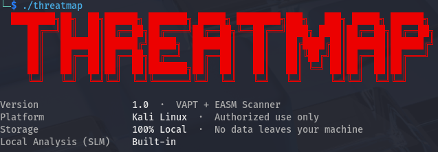
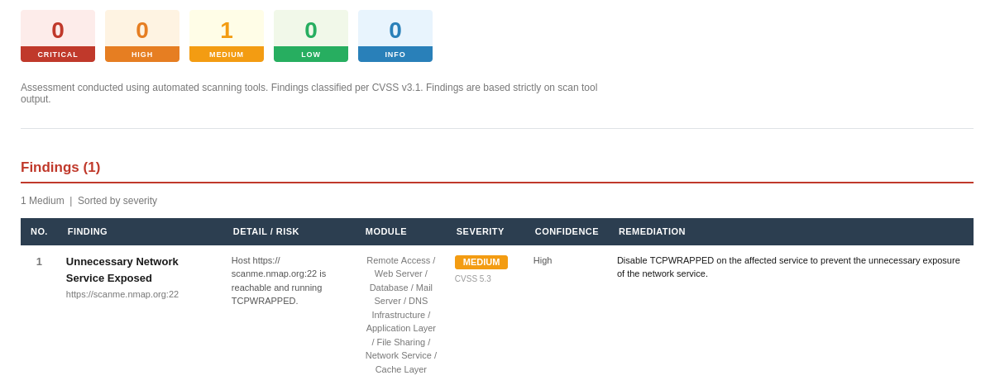

# ThreatMap

**Not another vulnerability scanner.**
ThreatMap is a workflow engine that turns raw scan outputs into structured findings and actionable intelligence.

---

## What it is

ThreatMap automates: discovery, evidence collection, local SLM analysis, and report generation from a clean CLI workflow.

- Converts raw tool outputs into prioritized findings
- Produces HTML, Excel, and evidence logs
- Keeps analysis local with no external API dependency
- Designed for developers and security engineers, not endless tool spam

---

## Screenshots

| CLI Run | HTML Report |
|--------|------------|
|  |  |

---

## Features

- Structured output from raw recon and scan results
- Local SLM-based analysis for vulnerability context
- HTML report and Excel export ready for sharing
- Evidence logs for auditing and review
- Minimal CLI experience with guided scan flow

---

## Installation

```bash
./install.sh
./threatmap
```

> One command to install, one command to start.

---

## Usage example

```bash
./threatmap
```

1. Enter target or asset list
2. Confirm authorization
3. Review discovered assets and scan progress
4. Open HTML report or export Excel

---

## Outputs

- **HTML** — readable, structured report for review
- **Excel** — exportable findings for stakeholders
- **Logs / Evidence** — raw proof from each scan step

---

## Workflow

1. **Discovery** — find assets and targets
2. **Scanning** — run the right tools automatically
3. **Evidence** — collect raw proofs and artifacts
4. **Analysis** — apply local SLM insights and structure findings
5. **Reporting** — generate HTML, Excel, and logs

---

## Why ThreatMap?

- Not just scanning → structured, actionable output
- Built for developers and security teams, not tool collectors
- Local SLM analysis with zero API calls
- Clean CLI UX instead of long tool chains

---

## Disclaimer

Use only on systems you own or are authorized to test. Unauthorized scanning is illegal.

---

## Contributing

Issues, fixes, and feature ideas are welcome. Send a PR or open an issue to improve the workflow.

